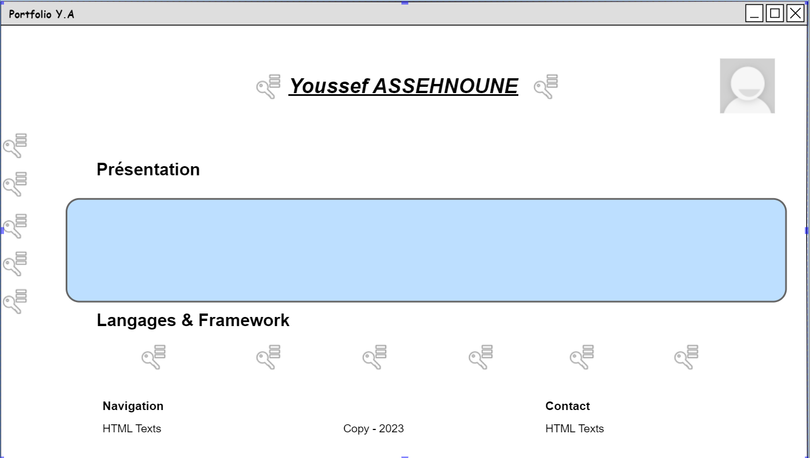
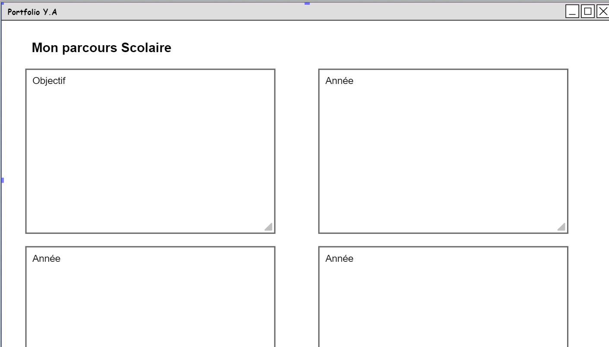
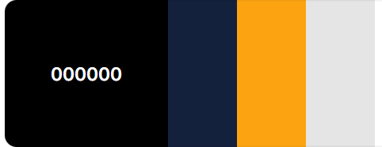

# Projet portflolio
>Bonjour, je suis Youssef ASSEHNOUNE et j'ai 20 ans. Je suis actuellement étudiant en 2ème année à l'école ITIC Paris. Vous trouvez ici le lien vers mon portfolio, il sera régulièrement mis à jour.

[Voir sur la page](https://youssef0801.github.io/projet-portfolio/)

[GlooMaps](https://www.gloomaps.com/zq4PNzMGH9)

#  Charte graphique et typographique
>En ce qui concerne la charte typographique j'ai choisi une font-family: 'Roboto', sans-serif. Et j'ai appliqué la charte graphique ci dessous :

